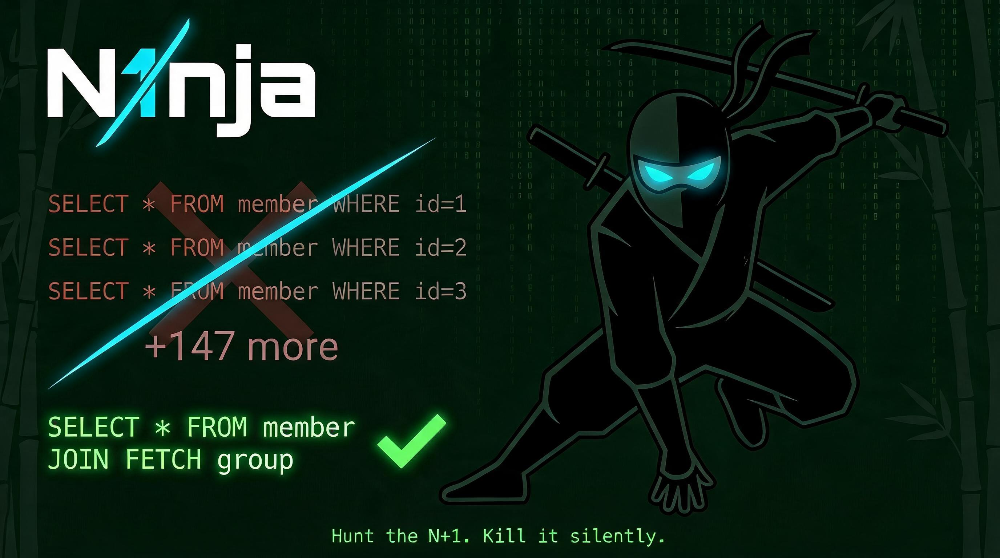

<div align="center">



**The MCP server that hunts down Hibernate/JPA N+1 queries in Spring Boot applications — silently, precisely, and fast.**

[](https://www.typescriptlang.org/)
[](https://nodejs.org/)
[](https://modelcontextprotocol.io/)
[](https://spring.io/projects/spring-boot)
[](LICENSE)
[](https://github.com/luk-s12/n1nja-mcp/actions/workflows/ci.yml)

---

🌐 **[Leer en español](README-ES.md)**

</div>

---

## ✨ What It Does

This MCP server plugs into Claude Code (or Claude Desktop) and gives it the ability to **read your Hibernate logs, detect performance anti-patterns, and pinpoint the exact line of code causing them** — without you having to manually search through thousands of log lines.

| Without this tool | With this tool |
|---|---|
| Grep through 50k lines of logs | `analyze_hibernate_log({ "logFile": "app.log" })` |
| Manually count repeated queries | Automatic N+1 detection with evidence |
| Guess which entity is the problem | Exact class, field, and method identified |
| Read Hibernate docs for the fix | Ranked fix suggestions with code examples |

---

## 🚀 Quick Start

> **Requirements:** Node.js ≥ 18, npm ≥ 8

### 1. Install N1nja

The installer script handles dependencies, build, Claude Desktop config, and language selection automatically:

```bash
git clone https://github.com/luk-s12/n1nja-mcp
cd n1nja-mcp
node install.js
```

> To uninstall later, run `node uninstall.js` from the project folder.

### 2. Set up Hibernate logging

The MCP reads a Hibernate log file, so your Spring Boot app needs to write one. See the **⚙️ Configuration** section (below) to enable it — then you're ready to run your first scan.

---

## ⚙️ Configuration

### Spring Boot Logging Setup

Add to your `application.yml` — this is what feeds the MCP:

```yaml
spring:
  jpa:
    show-sql: true
    properties:
      hibernate:
        format_sql: true
        generate_statistics: true

logging:
  file:
    name: logs/application.log        # MCP reads this file
  level:
    org.hibernate.SQL: DEBUG          # Captures all SQL
    org.hibernate.orm.jdbc.bind: TRACE # Captures bind parameters
    org.hibernate.stat: DEBUG         # Captures statistics
```

> **Tip:** Never enable `TRACE` logging in production. Use a dedicated Spring profile (`dev`, `local`) for this.

> **Don't want to touch your log `pattern`?** You don't have to. N1nja understands Spring Boot's **default log format** (`<timestamp>  LEVEL <PID> --- [thread] logger : message`), so enabling the levels above is enough — no custom `logging.pattern` required. A custom pattern with the thread right after the timestamp (`<timestamp> [thread] LEVEL ...`) is supported too.

### Detection Thresholds

Pass a `config` object to `analyze_hibernate_log` to override defaults:

| Parameter | Default | Description |
|---|---|---|
| `nPlusOneThreshold` | `10` | Min executions across the whole log to flag as N+1 |
| `nPlusOnePerRequestThreshold` | `3` | Min executions with distinct params in the same request/thread to flag as N+1 |
| `duplicateQueryThreshold` | `2` | Min executions to flag as DUPLICATE_QUERY |
| `largeResultThreshold` | `1000` | Row count threshold for LARGE_RESULT_SET |
| `slowQueryMs` | `500` | Execution time in ms for SLOW_QUERY |
| `cartesianJoinThreshold` | `2` | Min JOINs to warn about cartesian product |

You can override only the ones you care about — the rest keep their defaults:

```json
{
  "logFile": "logs/application.log",
  "config": {
    "nPlusOneThreshold": 5,
    "slowQueryMs": 200
  }
}
```

Or tune several at once, for a stricter mode:

```json
{
  "logFile": "logs/application.log",
  "config": {
    "nPlusOneThreshold": 3,
    "nPlusOnePerRequestThreshold": 2,
    "largeResultThreshold": 500,
    "slowQueryMs": 200
  }
}
```

That object is the argument the tool receives. From your MCP client you invoke it like this:

```
> analyze_hibernate_log logFile: "logs/application.log" config: { "nPlusOneThreshold": 3, "slowQueryMs": 200 }
```

Or, more naturally, just ask Claude and it builds the `config` for you:

```
> Analyze logs/application.log but flag N+1 from 3 repetitions and slow queries over 200ms
```

> The same `config` object is also accepted by `full_scan`.

### Run your first scan

With logging enabled, restart your MCP client and you're ready to go:

```
> full_scan
```

---

## 🛠️ MCP Tools

> Every parameter on every command is **optional** — each one falls back to a sensible default, so you can call any tool with no arguments. In the table, **`def.`** marks that default value.

| Command | Type | Key parameters (all optional) | Description |
|---------|------|-------------------------------|-------------|
| `full_scan` | ⭐ All-in-one | `logFile` (def. `logs/application.log`), `projectRoot` (def. cwd), `outputFile`, `config` | Parses log + scans source code + writes `.md` report with ready-to-copy fixes. **Start here.** |
| `analyze_hibernate_log` | Log | `logFile` (def. `logs/application.log`), `config` | Detects N+1, duplicate queries, large result sets, slow queries, cartesian products, SELECT * over-fetching, and deadlocks. |
| `find_n1_in_code` | Analysis | `projectRoot` (def. cwd) | Scans Java source and pinpoints the exact entity, field, and method causing each issue. |
| `find_missing_indexes` | Database | `envFile`, `projectRoot` | Connects to DB, cross-references WHERE/JOIN/ORDER BY columns against existing indexes, generates `CREATE INDEX` statements. |
| `show_report` | Query | `format` (def. `json`) | Returns the last generated report without re-parsing. Formats: `json`, `markdown`, `both`, `pdf`. |
| `monitor_log` | Real-time | `action` (def. `start`), `logFile` (def. `logs/application.log`) | Tails the log live. Actions: `start`, `stop`, `status`. Use `show_report` to see results. |
| `explain_sql` | Database | `sql`, `maxQueriesToExplain` (def. 3), `envFile`, `projectRoot` | Runs `EXPLAIN ANALYZE` and analyzes the execution plan. Credentials from `.env`, env vars, or Spring `application.properties`. |

---

### `full_scan` ⭐

The all-in-one command, and the one you'll reach for most. Think of it as `analyze_hibernate_log` + `find_n1_in_code` + a report written to disk, in a single call: it parses the log, scans the Spring Boot source code, cross-references each SQL pattern with the exact Java file and method causing it, and writes a detailed `.md` report with copy-paste ready fix code (`JOIN FETCH`, `@EntityGraph`, `@BatchSize`, `@Cacheable`, …).

Every parameter has a sensible default, so you can call it with no arguments at all:

| Parameter | Required | Default | Description |
|---|---|---|---|
| `logFile` | No | `logs/application.log` | Path to the Hibernate log file. Matches the recommended Spring Boot config (`logging.file.name=logs/application.log`). |
| `projectRoot` | No | current working directory | Root of the Spring Boot project (where `src/main/java` lives). Defaults to the directory the MCP server process was started in. |
| `outputFile` | No | `report/n1nja-report_{timestamp}.md` | Custom output path for the `.md` report. Each run writes a new timestamped file. |
| `config` | No | — | Detection thresholds override (see *Detection Thresholds*). |

```json
{ "logFile": "logs/application.log", "projectRoot": "/path/to/your/spring-boot-project" }
```

---

### `analyze_hibernate_log`

Reads a log file and produces a full analysis report. Unlike `full_scan`, this one stays at the **SQL level only** — it tells you *what* is wrong in the log, but it does not scan your Java source and does not write a file to disk. Reach for it when you only need a quick diagnosis of the log (e.g. to experiment with custom thresholds) without touching the codebase.

| Parameter | Required | Default | Description |
|---|---|---|---|
| `logFile` | No | `logs/application.log` | Path to the Spring Boot application log file. Matches the recommended Spring Boot config (`logging.file.name=logs/application.log`). |
| `config` | No | — | Detection thresholds override (see *Detection Thresholds*). |

```json
// Input
{ "logFile": "/path/to/application.log" }

// Output
{
  "summary": {
    "totalQueries": 245,
    "detectedIssues": 3
  },
  "issues": [
    {
      "type": "N_PLUS_1",
      "severity": "HIGH",
      "query": "select * from member where group_id=?",
      "executions": 150,
      "estimatedExtraQueries": 149
    }
  ]
}
```

---

### `find_n1_in_code` ⭐

**Phase 2 — The killer feature.**

Takes the latest report and scans your Spring Boot project source code to find:
- Which `@Entity` class is causing each N+1
- Which association field (`@OneToMany`, `@ManyToMany`, etc.) is being lazy-loaded
- Which service/controller method triggers the load
- Whether it happens inside a loop (highest risk)

Then proposes the best fix with working code examples.

| Parameter | Required | Default | Description |
|---|---|---|---|
| `projectRoot` | No | current working directory | Absolute path to the root of the Spring Boot project (where `src/main/java` lives). If omitted, it defaults to the directory the MCP server process was started in. |

```json
// Input — run after analyze_hibernate_log
{ "projectRoot": "/path/to/your/spring-boot-project" }

// Or use full_scan to do everything in a single step:
{ "logFile": "logs/application.log", "projectRoot": "/path/to/your/spring-boot-project" }
```

```
// Example output finding
🔴 N+1 DETECTED — HIGH severity

Entity:      Group.java
Field:       members (OneToMany, FETCH=LAZY)
Triggered:   GroupService.java:47 inside getGroupSummaries() ⚠️ INSIDE LOOP

Fix Option 1: JOIN FETCH
  @Query("SELECT g FROM Group g JOIN FETCH g.members")
  List<Group> findAllWithMembers();

Fix Option 2: @EntityGraph
  @EntityGraph(attributePaths = {"members"})
  List<Group> findAll();

Fix Option 3: @BatchSize
  @BatchSize(size = 25)
  @OneToMany(mappedBy = "group")
  private List<Member> members;
```

---

### `find_missing_indexes` 🔍

Connects to the database and cross-references the WHERE / JOIN ON / ORDER BY columns found in recent queries against the existing index catalog. Reports columns with no index and generates ready-to-run `CREATE INDEX` statements.

It works off the query list from the last report, so run `analyze_hibernate_log` or `full_scan` first to populate it. If DB credentials are missing or the connection fails, it shows exactly how to provide them (see [Database credentials](#database-credentials)).

| Parameter | Required | Default | Description |
|---|---|---|---|
| `envFile` | No | — | Path to a `.env` file with the `DB_*` credentials (e.g. the one in your Spring project). |
| `projectRoot` | No | cwd | Spring Boot project root — credentials are read from its `application.properties`/`yml` when not found in the environment. |

```json
{}                                              // uses env vars / .env in the working directory
{ "projectRoot": "C:/work/my-spring-app" }      // reads spring.datasource.* from the project
{ "envFile": "C:/work/my-spring-app/.env" }     // reads an explicit .env file
```

---

### `show_report`

Returns the most recently generated report without re-parsing the file. The report is whatever was last produced by `analyze_hibernate_log` or accumulated by `monitor_log`.

| Parameter | Required | Default | Description |
|---|---|---|---|
| `format` | No | `json` | Output format: `json`, `markdown`, `both`, or `pdf`. |

```json
// Input
{ "format": "markdown" }   // "json" | "markdown" | "both" | "pdf"
```

**About `pdf`:** unlike the text formats, a PDF can't be returned inline — so `format: "pdf"` renders the report to a styled file (`report/n1nja-report_{timestamp}.pdf`) and returns its path. It uses the **system's installed Edge or Chrome** in headless mode (`--print-to-pdf`) — no extra dependencies and no bundled Chromium. If neither browser is found, point N1nja at one via the `N1NJA_BROWSER` environment variable (set it to the browser executable path).

---

### `monitor_log`

Tails a log file in **real-time**. Where `analyze_hibernate_log` / `full_scan` read a log file *once, from start to end* (a snapshot), `monitor_log` keeps following the same file as the app writes to it (like `tail -f`): every new query is accumulated in memory and the detectors run live. Both read the same kind of file — the difference is *how*: a one-shot read vs. continuous tailing.

This is what lets you **isolate a single endpoint**: start the monitor, trigger exactly one request, and you'll see only the SQL that *that* action produced — no noise from the rest of the log. It's also the fastest way to validate a fix: apply it, repeat the request, and watch the N+1 disappear.

| Parameter | Required | Default | Description |
|---|---|---|---|
| `action` | No | `start` | What to do: `start`, `stop`, or `status`. |
| `logFile` | No | `logs/application.log` | Path to the log file to watch. |

```json
// Start watching
{ "logFile": "logs/application.log", "action": "start" }

// Check status
{ "logFile": "logs/application.log", "action": "status" }

// Stop watching
{ "logFile": "logs/application.log", "action": "stop" }
```

**Recommended workflow:**
```
1. monitor_log (start)
2. Navigate your app — trigger the feature you want to analyze
3. show_report
4. monitor_log (stop)
```

---

### `explain_sql` 🔬

Runs `EXPLAIN ANALYZE` on one or more queries and analyzes the execution plan directly against your database. It has two modes, driven by whether you pass `sql`:

- **Pass `sql`** → it explains that one specific query (and `maxQueriesToExplain` is ignored).
- **Omit `sql`** → it automatically grabs the worst queries (N+1 and slow ones) from the last report and explains the top `maxQueriesToExplain` of them.

| Parameter | Required | Default | Description |
|---|---|---|---|
| `sql` | No | — | Raw SQL query to explain. If omitted, the top queries from the last report are used. |
| `maxQueriesToExplain` | No | `3` | When `sql` is omitted, how many of the top queries from the report to explain. |
| `envFile` | No | — | Path to a `.env` file with the `DB_*` credentials (e.g. the one in your Spring project). |
| `projectRoot` | No | cwd | Spring Boot project root — credentials are read from its `application.properties`/`yml` when not found in the environment. |

```json
// Option A — explain a specific query
{ "sql": "select * from member where group_id = 1" }

// Option B — auto-explain the top N+1/slow queries from the last report
{ "maxQueriesToExplain": 3 }

// Option C — take credentials straight from the Spring project
{ "projectRoot": "C:/work/my-spring-app" }
```

**What it detects:**

| Issue | Description |
|---|---|
| `SEQ_SCAN` | Full table scan — no index used |
| `MISSING_INDEX` | Join/filter column has no index |
| `SORT_WITHOUT_INDEX` | ORDER BY forces in-memory sort |
| `HIGH_ROWS_REMOVED` | Filter discards >90% of scanned rows |
| `NESTED_LOOP_ON_LARGE_TABLE` | O(n×m) join on large tables |
| `HIGH_COST` | Plan cost exceeds 100k |
| `MYSQL_FULL_TABLE_SCAN` | MySQL equivalent of Seq Scan |
| `MYSQL_FILESORT` | MySQL sorting in a temp file |

<a id="database-credentials"></a>
**Database credentials** — resolved in this order (first complete set wins):

1. **`envFile` parameter** — an explicit path to a `.env` file with the `DB_*` variables. The file no longer needs to live where the MCP runs.
2. **Environment variables** (or a `.env` in the working directory):
   ```env
   DB_TYPE=postgresql
   DB_HOST=localhost
   DB_PORT=5432
   DB_NAME=your_database
   DB_USER=your_user
   DB_PASSWORD=your_password
   ```
3. **Your Spring project's config** — pass `projectRoot` (or run from the project directory) and N1nja reads `src/main/resources/application.properties` / `application.yml` automatically. Profile files (`application-{profile}.properties|yml`, e.g. `application-ci.yml`) are also supported: if the base file has no datasource, profiles are tried merged over the base, honoring `SPRING_PROFILES_ACTIVE` or the base's `spring.profiles.active` first.
   ```properties
   spring.datasource.url=jdbc:postgresql://localhost:5432/your_database
   spring.datasource.username=your_user
   spring.datasource.password=your_password
   ```
   `${VAR}` / `${VAR:default}` placeholders are resolved against the environment; `jdbc:mariadb:` URLs are treated as MySQL.

**Example output:**
```
🔴 SEQ_SCAN — HIGH
Table: member | Cost: 52,480 | Rows: 850,000

Full sequential scan. The database is reading every row.

Recommendation:
  CREATE INDEX idx_member_group_id ON member (group_id);
  Or in JPA: @Index(name = "idx_member_group_id", columnList = "group_id")
```

---

## 💬 Usage Examples

Once installed, just talk to Claude naturally. These are real conversations:

---

### 🔴 Scenario 1 — "My app is slow, I don't know why"

```
You:     Analyze my Hibernate logs at logs/application.log

Claude:  🥷 Parsing log file: application.log
         ✴️  48,320 lines processed — 312 queries found
         ✅ 4 issues detected

         ## 🔴 N+1 DETECTED — HIGH

         Query: SELECT * FROM member WHERE group_id = ?
         Executions: 150 times in 0.3s window
         Estimated extra queries: 149

         Parent query: SELECT * FROM groups
         → Every Group loaded → then members fetched one-by-one

         Fix: Add JOIN FETCH to your repository:
           @Query("SELECT g FROM Group g JOIN FETCH g.members")
           List<Group> findAllWithMembers();
```

---

### 🔍 Scenario 2 — Real-time monitoring while you click through the app

```
You:     Start watching logs/application.log

Claude:  ✅ Watcher active — tailing for Hibernate SQL

You:     [navigate your app — click through the feature you want to test]

You:     What did you find?

Claude:  show_report → 3 issues detected in the last 2 minutes:
         - N+1 on Order.items (87 extra queries)
         - DUPLICATE_QUERY: findById(userId) called 5x in one request
         - MISSING_PAGINATION on /api/products (no LIMIT clause)

You:     Stop watching

Claude:  ✅ Watcher stopped
```

---

### 🧠 Scenario 3 — Find the exact line of code causing the N+1

```
You:     Which class and method is causing this N+1? 
         My project is at /path/to/shop-api

Claude:  🥷 Scanning project: shop-api
         ✴️  12 JPA entities found
         ✅ Source analysis done — 2 findings

         ## Finding 1 — HIGH

         Entity:    Order.java
         Field:     items (@OneToMany, FETCH=LAZY)
         Triggered: OrderService.java:83 inside getOrderSummaries()
                    ⚠️ INSIDE A FOR LOOP — highest risk

         Fix Option 1 — JOIN FETCH (recommended):
           @Query("SELECT o FROM Order o JOIN FETCH o.items")
           List<Order> findAllWithItems();

         Fix Option 2 — @EntityGraph:
           @EntityGraph(attributePaths = {"items"})
           List<Order> findAll();
```

---

### 📊 Scenario 4 — Analyze the DB execution plan

```
You:     Run EXPLAIN on the top slow queries from the last report

Claude:  🥷 Connecting to database...
         ✴️  Connected to postgresql @ localhost
         ✴️  EXPLAIN query 1/3...
         ✅ EXPLAIN analysis complete — 2 plan issues found

         ## 🔴 SEQ_SCAN — HIGH
         Table: member | Cost: 52,480 | Rows removed: 91%

         Full table scan on every request.

         Fix:
           CREATE INDEX idx_member_group_id ON member (group_id);
           -- or in JPA:
           @Index(name = "idx_member_group_id", columnList = "group_id")
```

---

### ⚙️ Scenario 5 — Lower the detection threshold for strict mode

```
You:     Analyze logs/application.log but flag anything repeating 
         more than 3 times as N+1, and slow queries over 200ms

Claude:  [runs with custom config]
         nPlusOneThreshold: 3
         slowQueryMs: 200

         ✅ 9 issues detected (vs 4 with default thresholds)
```

---

## 📂 Example Files

The [`examples/`](examples/) folder contains ready-to-use sample files so you can try
N1nja without producing your own data first:

| File | What it is |
| --- | --- |
| [`examples/sample.log`](examples/sample.log) | A sample Hibernate log with a textbook N+1 (one query on `groups`, then one query per group on `member`). Use it as the input for `analyze_hibernate_log`. |
| [`examples/sample-report.json`](examples/sample-report.json) | An example of the JSON report N1nja produces after analyzing a log. |
| [`examples/detector-config.json`](examples/detector-config.json) | A sample detector config with all the tunable thresholds (`nPlusOneThreshold`, `slowQueryMs`, …). Pass it as the `config` argument to override the defaults. |
| [`examples/mcp-config.json`](examples/mcp-config.json) | The `mcpServers` snippet to register N1nja in your MCP client (Claude Code / Claude Desktop). |

Try it out:

```
Analyze my Hibernate logs at examples/sample.log
```

---

## 🔎 Detection Rules

### N+1 Query

Triggered when the same normalized query runs more than `nPlusOneThreshold` times:

```sql
-- This pattern in your logs:
SELECT * FROM member WHERE group_id = 1;
SELECT * FROM member WHERE group_id = 2;
SELECT * FROM member WHERE group_id = 3;
-- ... 147 more times

-- Normalizes to:
SELECT * FROM member WHERE group_id = ?
-- Flagged: 150 executions → N+1
```

### Duplicate Query

Same query repeated unnecessarily — usually a missing `@Cacheable` or a `findById()` inside a loop.

### Missing Pagination

`SELECT *` without `LIMIT`/`OFFSET`/`FETCH FIRST` on a full-table scan.

### Large Result Set

Queries returning more than `largeResultThreshold` total rows.

### Slow Query

Queries whose measured execution time exceeds `slowQueryMs`. The timing is taken from elapsed-time lines your app logs after each query (`"took 80ms"`, `"completed in 46ms"`, `"Time: 33ms"`, …). Queries with no measured timing are still checked by a **pattern-based** heuristic (missing WHERE on large joins, `LIKE '%…%'`, etc.) and flagged as suspected slow queries.

### Possible Cartesian Product

Multiple `JOIN FETCH` on collection associations without `DISTINCT` — classic Hibernate trap.

### Over-fetching

Two strategies. Literal `SELECT *` queries are flagged directly. Additionally, with `projectRoot` available, N1nja compares the columns each query fetches against the entity getters actually used in the Java method that triggered it — columns fetched but never read are reported as **column-level over-fetching**. Both recommend DTO projections.

### Deadlock / Lock Timeout

Scans log lines for lock errors from PostgreSQL (`deadlock detected`, `could not obtain lock`), MySQL (`Lock wait timeout exceeded`, `Deadlock found`), and Hibernate/JPA (`PessimisticLockException`, `LockTimeoutException`).

---

## 🧪 Testing

```bash
# Run all tests
npm test

# Watch mode
npm run test:watch

# Coverage report
npm run test:coverage

# TypeScript type check only
npm run typecheck
```

**Test coverage:**

| Suite | Tests | What's covered |
|---|---|---|
| `sql-normalizer.test.ts` | 18 | UUID, string, numeric, date normalization, IN-lists, lowercase, whitespace |
| `log-parser.test.ts` | 10 | Hibernate: prefix, DEBUG prefix, bind params, multi-query, statistics, timestamps, Spring Boot default & custom thread patterns |
| `n-plus-one.test.ts` | 5 | Threshold, parent inference, no-WHERE exclusion, custom config |
| `detectors.test.ts` | 14 | Pagination, duplicate, slow query, cartesian product detection |
| `over-fetching-large-result.test.ts` | 15 | SELECT * over-fetching and large result sets |
| `explain-analyzer.test.ts` | 12 | EXPLAIN plan analysis (seq scan, missing index, filesort, nested loops) |
| `slow-query-timing.test.ts` | 9 | Slow-query timing from Hibernate statistics |
| `deadlock.test.ts` | 5 | Deadlock / lock-timeout detection (PostgreSQL, MySQL, Hibernate) |
| `registry.test.ts` | 6 | MCP tool registry — schemas, defaults, optional params |
| `combined-report.test.ts` | 4 | Combined log + source report generation |
| `spring-datasource.test.ts` | 18 | DB credential resolution — JDBC URL parsing, `.properties`/`.yml`, Spring profiles, `envFile` precedence |

---

## 🤝 Contributing

Contributions are welcome! See [CONTRIBUTING.md](CONTRIBUTING.md) for the development
workflow, how to add a new detector, and coding guidelines.

Quick start:

```bash
git checkout -b feature/your-feature
npm test && npm run typecheck && npm run lint
```

---

## 📄 License

MIT © 2026 — See [LICENSE](LICENSE) for details.

---

<div align="center">

🥷 **N1nja** — Built to be used with [Claude Code](https://claude.ai/code) · Powered by [Model Context Protocol](https://modelcontextprotocol.io/)

</div>
